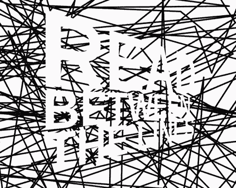

Scribble Text (Read Between the Lines)

[**Try me!**](https://scribble-text.netlify.app/)

## Technologies Used

&nbsp;&nbsp;&nbsp;&nbsp;&nbsp;&nbsp;

&nbsp;&nbsp;&nbsp;&nbsp;&nbsp;&nbsp;

&nbsp;&nbsp;&nbsp;&nbsp;&nbsp;&nbsp;

&nbsp;&nbsp;&nbsp;&nbsp;&nbsp;&nbsp;

## Description

A line is drawn from the middle of the canvas to a random point. A new line is drawn from that random point, to a new random point, and so on, and so on. In the meanwhile, some text appears.

<<<<<<< HEAD
Click to switch colors and redraw, double-click to enter fullscreen mode, double-click again (or press ESC) to leave fullscreen mode.

## Screenshots

[screenshot](./assets/screenshot-01.png)

[screenshot](./assets/screenshot-02.png)
=======

Click to switch colors and redraw, double-click to enter fullscreen mode, double-click again (or press ESC) to leave fullscreen mode.

>>>>>>> f4a42af5d13757f721640e59f7ac5716f6f8a47d

[screenshot](./assets/screenshot-03.png)

## License

<<<<<<< HEAD

=======

Copyright (c) 2022 Michael Kolesidis 
Licensed under the [GNU General Public License v3.0](https://www.gnu.org/licenses/gpl-3.0.html).
>>>>>>> f4a42af5d13757f721640e59f7ac5716f6f8a47d

Copyright (c) 2023 Michael Kolesidis 
Licensed under the [GNU Affero General Public License v3.0](https://www.gnu.org/licenses/agpl-3.0.html).
