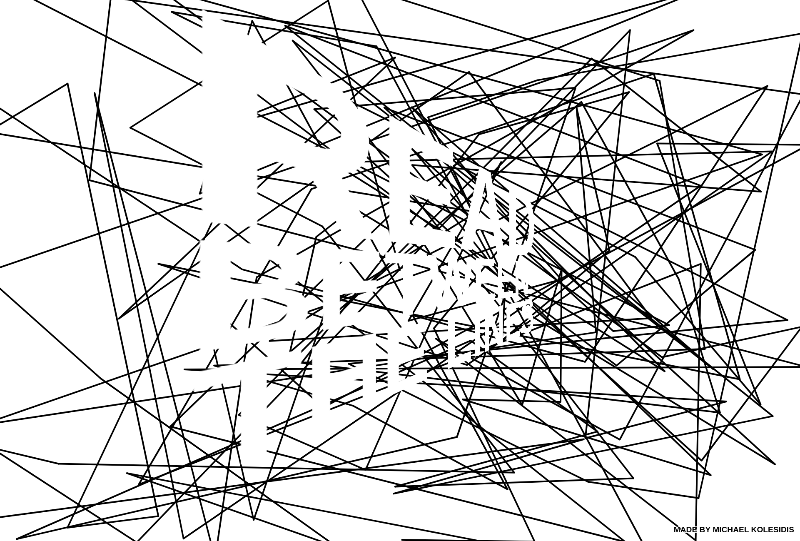
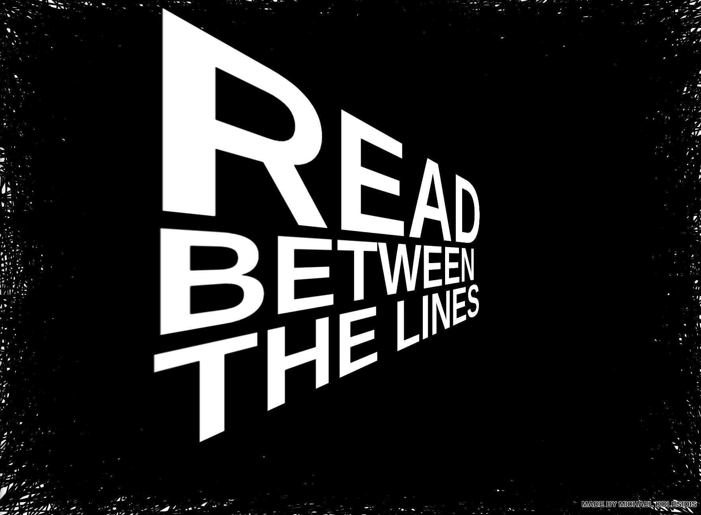

## Scribble Text

Text gradually appears while scribbling.

## Technologies Used

&nbsp;&nbsp;&nbsp;&nbsp;&nbsp;&nbsp;

&nbsp;&nbsp;&nbsp;&nbsp;&nbsp;&nbsp;

&nbsp;&nbsp;&nbsp;&nbsp;&nbsp;&nbsp;

&nbsp;&nbsp;&nbsp;&nbsp;&nbsp;&nbsp;

## Description

A line is drawn from the middle of the canvas to a random point. A new line is drawn from that random point, to a new random point, and so on, and so on. In the meanwhile, some text appears.

Click to switch colors and redraw, double-click to enter fullscreen mode, double-click again (or press ESC) to leave fullscreen mode.

## Screenshots

## License

Copyright (c) 2023 Michael Kolesidis 
Licensed under the [GNU Affero General Public License v3.0](https://www.gnu.org/licenses/agpl-3.0.html).
